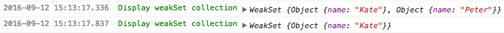
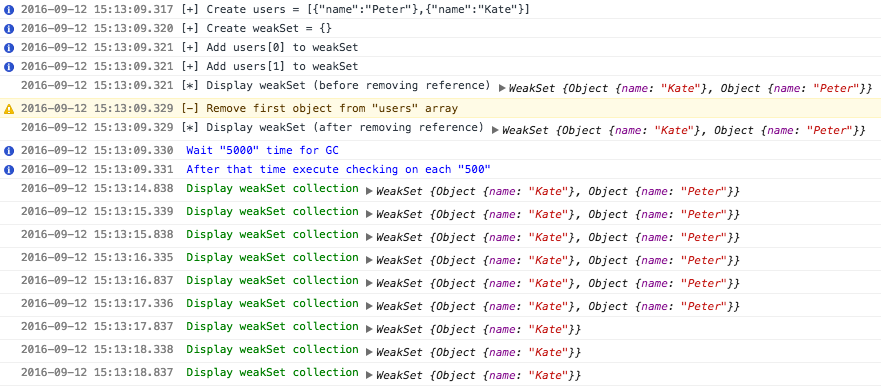
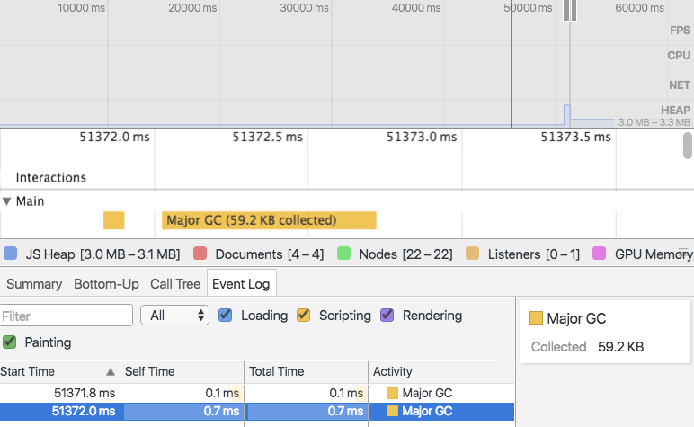

# test-es2015-weakset

> :ledger: Testing WeakSet (reducing by Garbage Collector) from ECMAScript 2015 spec

## How it works?

1. Create `users` array with simple literal objects

    ```javascript
    var users = [{ name: 'Peter' }, { name: 'Kate' }];
    ```

2. Create `weakSet` object - instance of WeakSet constructor
    
    ```javascript
    var weakSet = new WeakSet();
    ```

3. Add two items where they have reference to objects from users

    ```javascript
    weakSet.add(users[0]);
    weakSet.add(users[1]);
    ```

4. Remove first element from `users` array
    
    ```javascript
    users.splice(0, 1);
    ```

5. Wait some time for Garbage Collector, which reduce `weakSet` collection



## Explanation

At first, Garbage Collector reduce WeakSet (DevTools Console)



Next, Garbage Collector was invoke (DevTools Timeline)



On above screenshot we can see that Garbage Collector was invoked couple seconds after idle time.
GC remove values from `WeakSet`. Proof is available on the first screenshot.

## License

[The MIT License](http://piecioshka.mit-license.org) @ 2016
